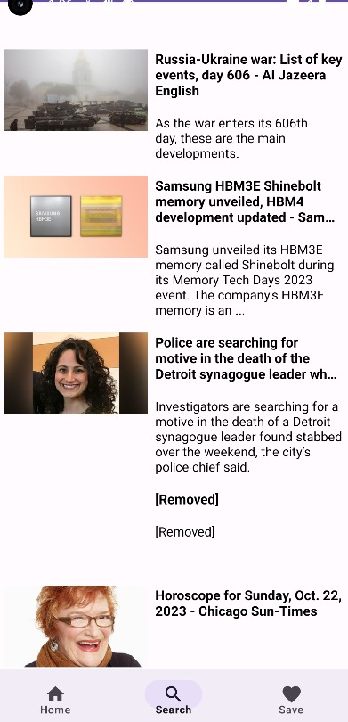
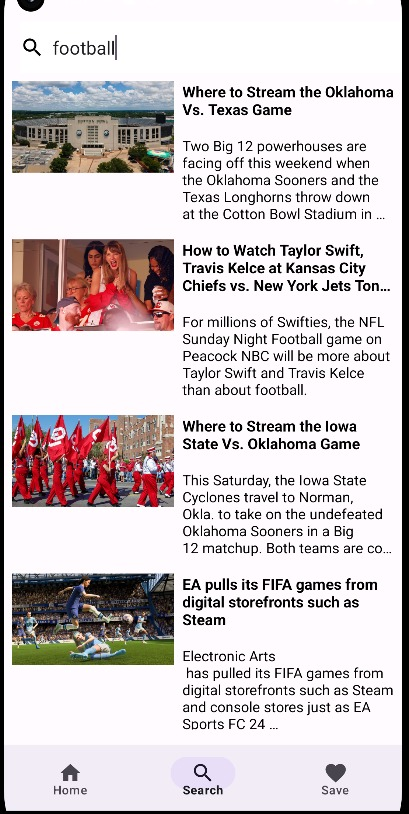
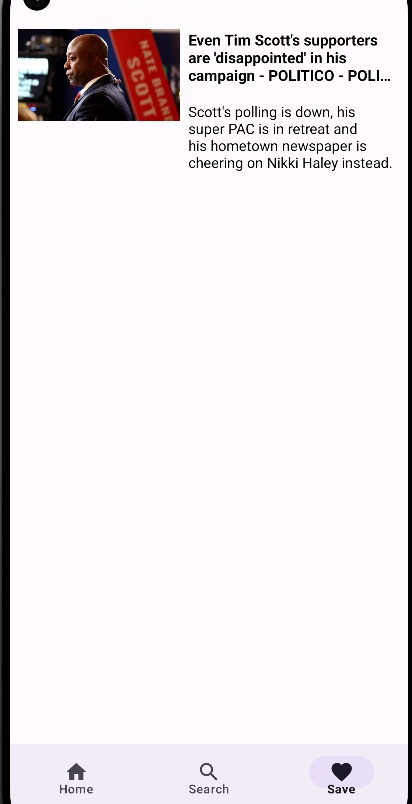
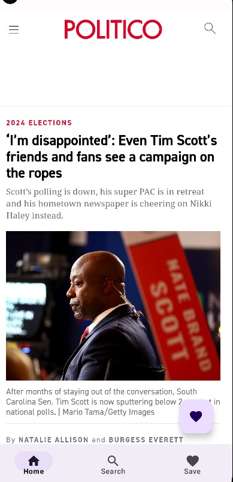

# News App

The News App is built using the following technologies and tools:
## Stack
- **Android Kotlin XML**
- **MVVM Architecture** ViewModel,Repository
- **Room library:** for saving locally access
- **Retrofit** [News API](https://newsapi.org/)
- **RecyclerView(DiffUtil)**
- **WebView**
-  **Coroutines**
  

# Screenshots
|       |       |       |         | 
| :---: | :---: | :---: |   :---: |
|  |  |  |  |
| *News Screen* | *News Search Screen* | *News Save Screen* |  *News WebView Screen* |

# Contact
- **my telegramm : @nuriksdu17**
- **my linkedIn : https://www.linkedin.com/in/nurali-umirzak-443000247/**

